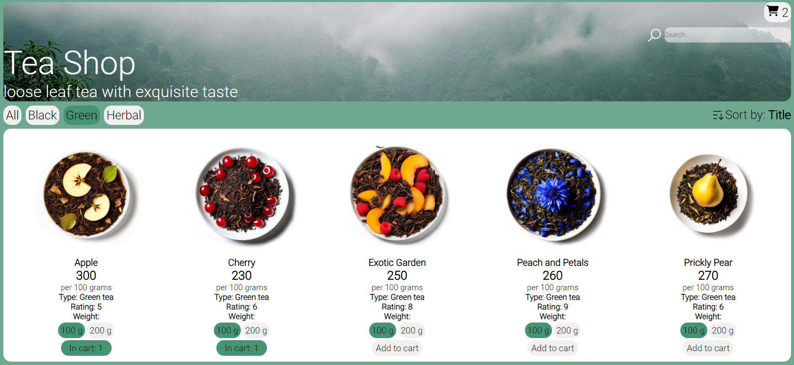

# Tea Shop

<br />
Интернет-магазин листового чая. Сортировка товаров по типу, цене, названию и рейтингу. Реализован поиск товара по названию, просмотр карточки чая с изображением и описанием, выбор веса чая и добавление его в корзину, расчёт цены товара в корзине в зависимости от выбранного веса.
<br />
Link: https://teaonlinestore.netlify.app/

## Technologies Used

- Typescript
- React
- Redux Toolkit (включая createAsyncThunk для асинхронных запросов)
- SCSS (Sass)
- React Router
- Custom React Hooks
- Static Data Source (JSON)

## Preview



## Features

- Просмотр списка товаров с указанием названия, цены, изображения
- Сортировка результатов выдачи по:
  - Типу чая (чёрный/зелёный/травяной)
  - Названию
  - Цене (по возрастанию и убыванию)
  - Рейтингу (по возрастанию и убыванию)
- Возможность поиска чая по названию
- Пагинация для навигации по результатам выдачи
- Просмотр страницы каждого отдельного чая с описанием
- Возможность добавления чая в корзину со страницы выдачи
- Возможность добавления чая в корзину со страницы карточки товара
- Возможность выбора веса товара (100г/200г) при добавлении в корзину и расчёт стоимости чая в корзине в зависимости от веса
- Подсчёт стоимости товаров, добавленных в корзину
- Удаление товаров из корзины
- Кастомный хук для получения данных о конкретном чае с помощью его id
- Кастомный хук для добавления чая в корзину
- Для целей демонстрации создан статический JSON-файл, предоставляющий данные о товарах

## How to start project

in the project directory enter:

```js
npm install
```

and then

```js
npm run dev
```
